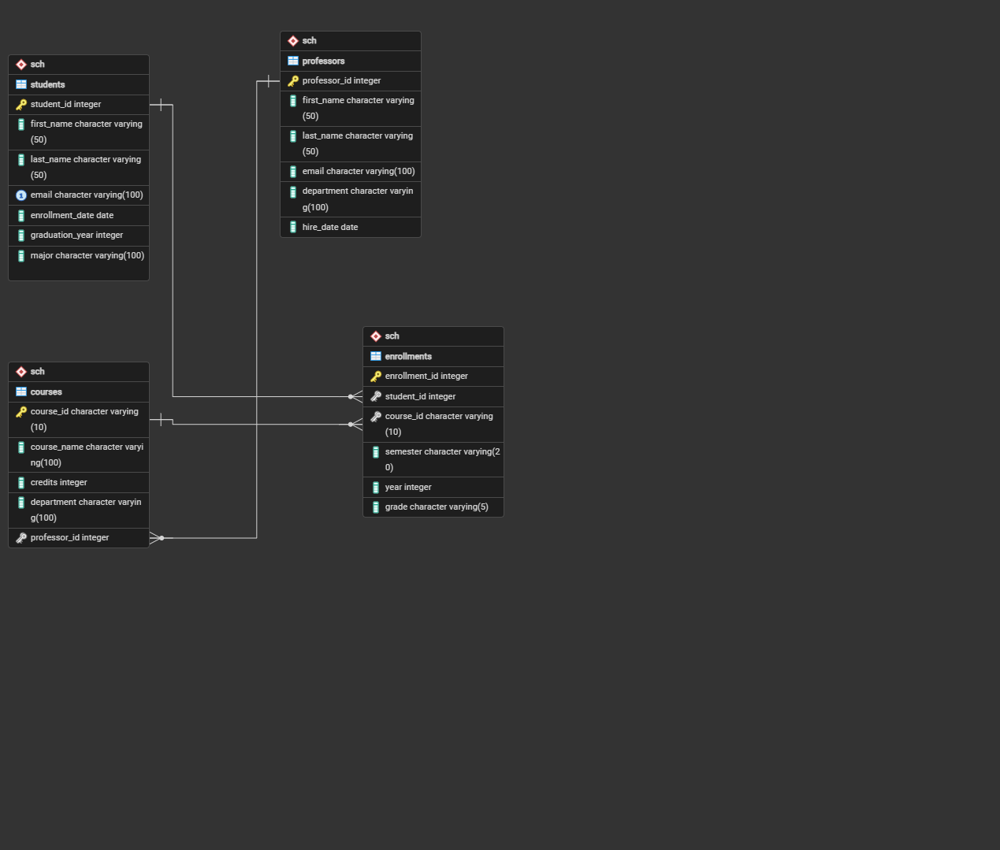

# MIS443 - Assignment 4: Individual PostgreSQL Database Project

**Course:** MIS 443 - Business Data Management
**Institution:** Eastern International University (EIU)
**Student:** Đặng Huỳnh Quỳnh Như - 2032300287
**Major:** Business Analytics
**Academic Term:** Quarter 4/2025-2026

## Project Description

This project implements an end-to-end relational database system for a university environment using **PostgreSQL 16** and **pgAdmin 4**. The **School Database** centralizes core operational entities — **Students, Professors, Courses, and Enrollments** — enabling key academic departments (Registrar, Financial Aid, Curriculum Committee) to perform data auditing, monitor performance, and execute business queries efficiently.

## Tools Used

- PostgreSQL (database engine)
- pgAdmin 4 (database creation, CSV import, and query execution)
- CSV (data storage format)
- GitHub (project publication)

## Folder Structure

```
MIS443_2032300287_School/
│
├── codes/
│   ├── import_data.sql
│   └── exercise.sql
│
├── data/
│   ├── students.csv
│   ├── professors.csv
│   ├── courses.csv
│   └── enrollments.csv
│
├── report/
│   ├── ERD.png
│   └── MIS443_2032300287_School_Report.pdf
│
└── README.md
```

## Database Architecture & Schema Design



### Table Descriptions & Relationships

1. **`sch.students`**: Stores student profiles, majors, enrollment dates, and expected graduation years.
2. **`sch.professors`**: Manages faculty records, departments, and hire dates.
3. **`sch.courses`**: Academic course catalog containing course codes, credit loads, and assigned professors.
4. **`sch.enrollments`**: Junction table establishing a **Many-to-Many (N:M)** relationship between Students and Courses, capturing semester, academic year, and grades.

- **Professors ➔ Courses (1:N):** One professor can teach multiple courses.
- **Students ➔ Enrollments (1:N):** One student can have multiple enrollment records.
- **Courses ➔ Enrollments (1:N):** One course can have multiple student enrollments.

## How to Run

1. Open pgAdmin 4 and connect to your local PostgreSQL server.
2. Run `codes/import_data.sql` to create the database, tables, and load the data from the `data/` folder.
3. Run `codes/exercise.sql` to execute the SQL practice questions and review the results.

## GitHub Repository

https://github.com/NhuqDangg/MIS-443---Business-Data-Management/tree/main/MIS443_2032300287_School
