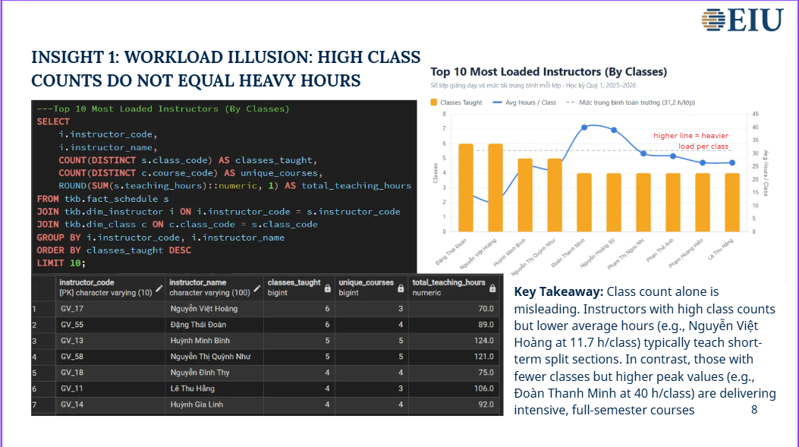
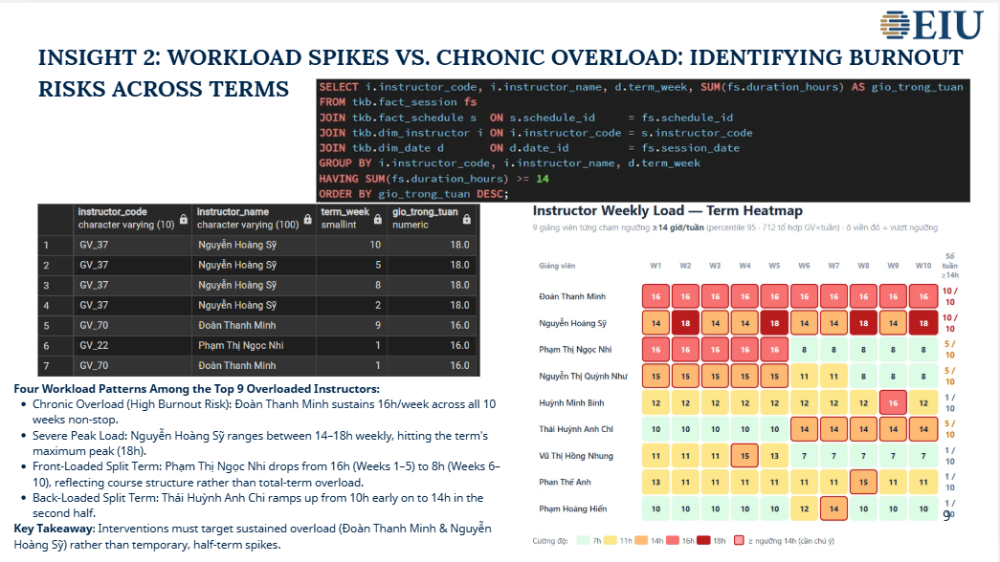
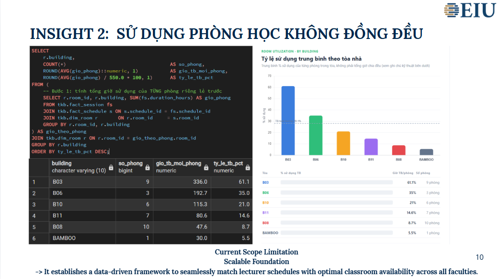
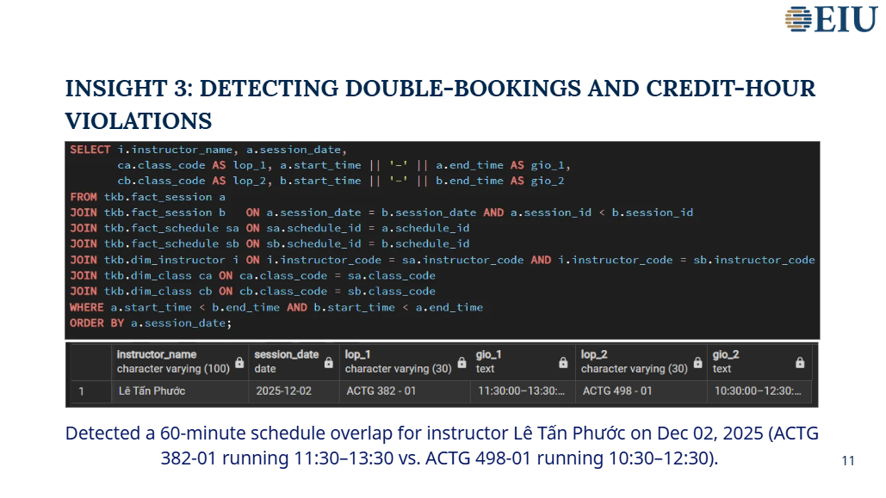

# Schedule Analytics — Q1 Timetable Data Warehouse & Workload Analysis

Đặng Huỳnh Quỳnh Như · Business Analytics Student · Eastern International University IRN 2032300287 · Quarter 1, 2025–2026

   

---

## What this project is

The registrar's Q1 timetable ships as one flat Excel sheet — the kind every business analyst eventually inherits. Two cells routinely hold more than one value at once (`Day = 'MR'`, `Period = '06/10-29/11 ; 08/12-13/12'`), which makes it unreliable to filter or pivot directly, and it can't answer operational questions like *"which instructor is overloaded this week?"* or *"which classroom is sitting empty?"* without manual cross-referencing.

This project rebuilds it as a **star schema in PostgreSQL** (5 dimensions + 1 fact + 2 bridge tables to resolve the multi-value cells + 1 session-level fact for date-level detail), then writes the SQL that answers those questions directly instead of by hand.

## Data model

| Table | Grain | Rows | Primary key |
|---|---|---|---|
| `dim_instructor` | one instructor | 74 | `instructor_code` |
| `dim_room` | one room | 36 | `room_id` |
| `dim_course` | one course | 114 | `course_code` |
| `dim_date` | one calendar date | 69 | `date_id` |
| `dim_class` | one class section (course × CRN) | 141 | `class_code` |
| `fact_schedule` | one instructor × one recurring time block | 216 | `schedule_id` |
| `schedule_period` | bridge — splits multi-date-range cells | 233 | `period_id` |
| `schedule_day` | bridge — splits multi-day-code cells (`'MR'` → `M`, `R`) | 363 | `(schedule_id, day_code)` |
| `fact_session` | one class meeting on one specific date | 2,697 | `session_id` |

Cross-check built into the model: `SUM(fact_schedule.teaching_hours)` = `SUM(fact_session.duration_hours)` = **5,564 hours**, verified at both grains.

ERD: see `erd/ERD.png` (exported from pgAdmin's ERD Tool — `.pgerd` doesn't render on GitHub).

## Insights this project surfaces

| # | Question asked | Query technique |
|---|---|---|
| 1 | Does teaching more classes mean a heavier load? | `COUNT(DISTINCT)` vs. `SUM()` per instructor — the two rank differently |
| 2 | Chronic overload vs. a temporary spike — which instructors need intervention? | `GROUP BY` instructor × term_week, `HAVING SUM(...) >= 14`, visualized as a heatmap |
| 3 | Is classroom usage even across buildings? | Two-step aggregation — per-room % first, then `AVG()` by building, to avoid skew from buildings with different room counts |
| 4 | Are any two class sections double-booked for the same instructor or room? | Self-join on `fact_session` with an overlap condition (`a.start_time < b.end_time AND b.start_time < a.end_time`) |






**Takeaway for the registrar:** cap weekly teaching hours with early warnings before peak weeks, and run the double-booking / hour-rule checks as SQL views *before* a schedule is published, not after.

## How to run this project

```bash
psql -d your_database -f sql/01_create_table.sql
```

Load the CSVs in `data/` in this order (dimensions → fact → bridges):

```
dim_instructor → dim_room → dim_course → dim_date → dim_class
→ fact_schedule → schedule_period → schedule_day → fact_session
```

Either via pgAdmin's *Import/Export Data* (Format = csv, Header = Yes, Encoding = UTF8) on each table, or by uncommenting the `\copy` block in `sql/02_import_data.sql` and running it with `psql`.

Then run `sql/03_extract_data.sql` — row counts per table should match the table above, and the two `SUM()` totals should both equal 5,564.

## Skills this project covers

| Foundations | Querying | Aggregation & Joins | Window Functions | Business Framing |
|---|---|---|---|---|
| ✅ | ✅ | ✅ | – | ✅ |

*(Window functions aren't used yet — a natural next step would be ranking instructors by weekly load with `RANK() OVER (PARTITION BY term_week ORDER BY hours DESC)`.)*

## Repo structure

```
MIS443_2032300287_ScheduleAnalytics/
├── README.md
├── erd/ERD.png
├── sql/
│   ├── 01_create_table.sql
│   ├── 02_import_data.sql
│   └── 03_extract_data.sql
├── data/            (9 CSVs, one per table)
└── screenshots/     (4 insight images + recommendation slide)
```
